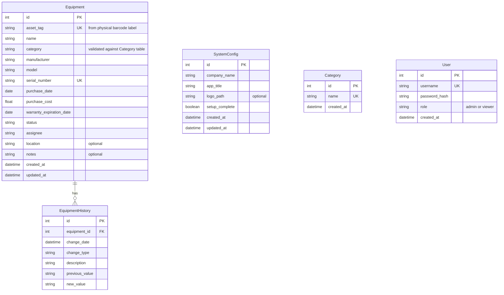

# Design Document: Equipment Inventory Management

## Overview

The Equipment Inventory Management System is a web application that allows IT Administrators to track company IT equipment through its full lifecycle. The system provides CRUD operations for equipment records, assignment tracking, status management, search/filter capabilities, a summary dashboard, and customizable branding/configuration.

The application uses a Python/Flask backend serving both a REST API and server-rendered HTML templates. Data is persisted in a SQLite database for simplicity and portability. The frontend uses standard HTML, CSS, and JavaScript with Jinja2 templates rendered by Flask.

On first launch, a setup wizard guides the Administrator through initial configuration (company name, application title, logo upload, equipment categories, and the first Admin user account). After setup, these settings are manageable through a dedicated Settings page.

The system requires authentication for all routes except the login page. Two roles are supported: Admin (full access) and Viewer (read-only). Sessions are managed via Flask-Login. Passwords are hashed using werkzeug.security and never stored in plaintext.

### Key Design Decisions

- **Flask**: Lightweight Python web framework, well-suited for this scope of application.
- **SQLite**: Zero-configuration embedded database. Sufficient for a single-company inventory system.
- **Jinja2 Templates**: Server-side rendering keeps the stack simple and avoids a separate frontend build step.
- **Flask-SQLAlchemy**: ORM for database interactions, providing model definitions and query building.
- **Manual Asset Tags with Barcode Support**: Asset tags are entered manually or scanned from pre-printed physical barcode labels using a USB barcode scanner. USB scanners emulate keyboard input, so the system detects rapid keystroke sequences followed by Enter to distinguish scans from manual typing. This avoids auto-generation and ties digital records to physical labels on equipment.
- **Docker Deployment**: The application is packaged as a single Docker container for consistent, reproducible deployment. SQLite data is persisted via a Docker volume mount, keeping the deployment model simple (no external database service). A docker-compose.yml is provided for one-command launch.
- **Flask-Login**: Session-based authentication management. Provides `login_required` decorator, `current_user` proxy, and session handling. Appropriate for a small-user-count application.
- **werkzeug.security**: Password hashing via `generate_password_hash` / `check_password_hash`. Bundled with Flask, no extra dependency needed.
- **Role-Based Access Control**: Two roles (Admin, Viewer) enforced via a custom `admin_required` decorator. Viewer role sees the UI with write-action buttons hidden/disabled.
- **First-Run Setup Wizard**: A middleware decorator checks whether system configuration exists. If not, all routes redirect to the setup wizard. The setup wizard also creates the first Admin user account. This ensures the system is properly branded, configured, and secured before use.
- **Dynamic Categories**: Equipment categories are stored in a `Category` database table rather than hardcoded, allowing Administrators to manage them through the UI. The Equipment model's `category` field is a string validated against this table.
- **Uploaded File Storage**: The company logo is stored as an uploaded file in a volume-mounted directory (`/app/data/uploads/`) so it persists across Docker container restarts.

## Architecture

The system follows a standard MVC (Model-View-Controller) pattern:

```mermaid
graph TD
    subgraph DockerContainer["Docker Container"]
        Flask["Flask Application"]
        LoginManager["Flask-Login Manager"]
        Middleware["First-Run Middleware"]
        AuthMiddleware["Auth Middleware (login_required)"]
        Flask -->|Configures| LoginManager
        Flask -->|Checks| Middleware
        Middleware -->|Setup incomplete| SetupWizard["Setup Wizard Routes"]
        Middleware -->|Setup complete| AuthMiddleware
        AuthMiddleware -->|Not authenticated| LoginPage["Login Page"]
        AuthMiddleware -->|Authenticated| RoleCheck["Role Check (admin_required)"]
        RoleCheck -->|Admin| Controllers["Route Handlers (Controllers)"]
        RoleCheck -->|Viewer (read-only)| ReadOnlyControllers["Read-Only Route Handlers"]
        Flask -->|Renders| Templates["Jinja2 Templates"]
        Controllers -->|Uses| Services["Service Layer"]
        ReadOnlyControllers -->|Uses| Services
        SetupWizard -->|Uses| Services
        Services -->|Queries/Mutates| Models["SQLAlchemy Models"]
        Models -->|Reads/Writes| DB["SQLite Database"]
    end
    Scanner["USB Barcode Scanner"] -->|Keyboard Emulation| Browser["Web Browser"]
    Browser -->|HTTP Requests| HostPort["Configurable Host Port"]
    HostPort -->|Port Mapping| Flask
    Templates -->|HTML Response| Browser
    DataVolume["Docker Volume"] -.->|Persists| DB
    DataVolume -.->|Persists| Uploads["Uploaded Files (logos)"]
```

### Layers

1. **Presentation Layer**: Jinja2 HTML templates with CSS and JavaScript for interactivity (confirmation dialogs, dynamic filtering, barcode scanner input detection).
2. **Controller Layer**: Flask route handlers that parse requests, call services, and return responses.
3. **Service Layer**: Business logic including validation, status transition rules, assignment rules, and history recording.
4. **Data Layer**: SQLAlchemy models and the SQLite database.

### Barcode Scanner Input Detection

USB barcode scanners emulate a keyboard — they type the barcode value character-by-character into the focused input field, then send an Enter keypress. The system distinguishes scanner input from manual typing using a client-side JavaScript module:

- Track keystroke timing on asset tag and search input fields.
- If a sequence of characters arrives within a short time window (e.g., all characters within 50ms of each other) followed by Enter, classify it as a barcode scan.
- On scan detection in the search field: immediately submit the search. If exactly one result matches by asset tag, navigate directly to that record's detail view.
- On scan detection in the asset tag registration field: populate the field with the scanned value.
- Manual typing (slower keystrokes) is handled normally with no special behavior.

## Components and Interfaces

### Flask Route Handlers

| Route | Method | Description |
|---|---|---|
| `/` | GET | Dashboard with summary counts |
| `/equipment` | GET | List all equipment with search/sort. Displays Asset Tag, Name, Category, Status, Assignee, and Location columns. |
| `/equipment/scan-lookup` | GET | Look up equipment by exact asset tag (barcode scan). Redirects to detail view if exactly one match found. |
| `/equipment/new` | GET | Registration form |
| `/equipment` | POST | Create new equipment record |
| `/equipment/<id>` | GET | View equipment details and history (includes Location and Notes) |
| `/equipment/<id>/edit` | GET | Edit form |
| `/equipment/<id>` | PUT/POST | Update equipment record |
| `/equipment/<id>/delete` | POST | Delete equipment record |
| `/equipment/<id>/assign` | POST | Assign equipment to employee/department |
| `/equipment/<id>/unassign` | POST | Unassign equipment |
| `/equipment/<id>/status` | POST | Change equipment status |
| `/setup` | GET | Setup wizard page (first-run only) |
| `/setup` | POST | Save setup wizard configuration and create initial Admin account |
| `/login` | GET | Login page |
| `/login` | POST | Authenticate user credentials |
| `/logout` | GET | Log out current user and terminate session |
| `/settings` | GET | Settings page (Admin only) |
| `/settings` | POST | Update settings (branding and categories) (Admin only) |
| `/settings/categories` | POST | Add a new category (Admin only) |
| `/settings/categories/<id>/delete` | POST | Delete a category (rejected if in use) (Admin only) |
| `/settings/users` | GET | User management section on Settings page (Admin only) |
| `/settings/users` | POST | Create a new user (Admin only) |
| `/settings/users/<id>/delete` | POST | Delete a user (Admin only) |
| `/settings/users/<id>/role` | POST | Change a user's role (Admin only) |
| `/uploads/<filename>` | GET | Serve uploaded files (logo) |

### Service Layer Interface

```python
class EquipmentService:
    def create_equipment(self, data: dict) -> Equipment:
        """Validate and create a new equipment record with user-provided asset tag."""

    def update_equipment(self, equipment_id: int, data: dict, expected_updated_at: datetime = None) -> Equipment:
        """Validate and update an equipment record, recording history.
        If expected_updated_at is provided, compares it against the current record's updated_at.
        Raises ConflictError if they don't match (optimistic concurrency check)."""

    def delete_equipment(self, equipment_id: int) -> None:
        """Delete an equipment record."""

    def get_equipment(self, equipment_id: int) -> Equipment:
        """Retrieve a single equipment record with full details."""

    def list_equipment(self, search: str = None, sort_by: str = None, sort_order: str = "asc") -> list[Equipment]:
        """List equipment with optional search and sorting."""

    def lookup_by_asset_tag(self, asset_tag: str) -> Equipment | None:
        """Look up a single equipment record by exact asset tag match. Used for barcode scan direct navigation."""

    def assign_equipment(self, equipment_id: int, assignee: str, expected_updated_at: datetime = None) -> Equipment:
        """Assign equipment to an employee/department. Rejects if Retired or Under Repair.
        If expected_updated_at is provided, performs optimistic concurrency check."""

    def unassign_equipment(self, equipment_id: int, expected_updated_at: datetime = None) -> Equipment:
        """Unassign equipment and set status to Available.
        If expected_updated_at is provided, performs optimistic concurrency check."""

    def change_status(self, equipment_id: int, new_status: str, expected_updated_at: datetime = None) -> Equipment:
        """Change equipment status, enforcing transition rules.
        If expected_updated_at is provided, performs optimistic concurrency check."""

    def get_dashboard_summary(self) -> dict:
        """Return counts grouped by status and category."""


class ConfigService:
    def is_setup_complete(self) -> bool:
        """Check if the system has been configured (SystemConfig record exists with setup_complete=True)."""

    def get_config(self) -> SystemConfig | None:
        """Retrieve the current system configuration, or None if not yet set up."""

    def save_setup(self, company_name: str, app_title: str, logo_file=None, categories: list[str] = None, admin_username: str = None, admin_password: str = None) -> SystemConfig:
        """Save initial setup configuration. Creates SystemConfig, default/custom Category records, and the initial Admin user account."""

    def update_config(self, company_name: str = None, app_title: str = None, logo_file=None) -> SystemConfig:
        """Update branding settings (company name, app title, logo)."""


class CategoryService:
    def list_categories(self) -> list[Category]:
        """Return all categories."""

    def add_category(self, name: str) -> Category:
        """Add a new category. Rejects duplicates."""

    def delete_category(self, category_id: int) -> None:
        """Delete a category. Rejects if any Equipment records reference it."""

    def get_default_categories(self) -> list[str]:
        """Return the default category names: Laptops, Monitors, Peripherals, Servers, Networking."""


class UserService:
    def create_user(self, username: str, password: str, role: str = "viewer") -> User:
        """Create a new user with a hashed password. Defaults to Viewer role. Rejects duplicate usernames."""

    def delete_user(self, user_id: int) -> None:
        """Delete a user account."""

    def authenticate(self, username: str, password: str) -> User | None:
        """Verify credentials. Returns the User if valid, None otherwise."""

    def change_role(self, user_id: int, new_role: str) -> User:
        """Change a user's role. new_role must be 'admin' or 'viewer'."""

    def list_users(self) -> list[User]:
        """Return all user accounts."""

    def get_user_by_id(self, user_id: int) -> User | None:
        """Retrieve a user by ID. Used by Flask-Login's user_loader."""
```

### Validation Module

```python
def validate_equipment_data(data: dict, is_update: bool = False) -> list[str]:
    """
    Validate equipment form data. Returns a list of error messages.
    Checks required fields (including asset_tag), data types, 
    asset tag uniqueness, serial number uniqueness, and that the
    category value exists in the Category table.
    Location and Notes are optional and accepted but not required.
    """
```

### First-Run Middleware

```python
def setup_required(f):
    """
    Flask decorator/before_request handler that checks if SystemConfig
    exists with setup_complete=True. If not, redirects to /setup.
    Exempts the /setup, /login routes and static file routes from the redirect.
    """
```

### Authentication Integration

```python
from flask_login import LoginManager, login_required, current_user

login_manager = LoginManager()
login_manager.login_view = "login"  # Redirect target for unauthenticated users

@login_manager.user_loader
def load_user(user_id: str) -> User | None:
    """Load a user by ID for Flask-Login session management."""

def admin_required(f):
    """
    Decorator that checks current_user.role == 'admin'.
    Returns 403 Forbidden if the user is a Viewer.
    Must be used after @login_required.
    """
```

## Data Models

### Equipment Model

```python
class Equipment(db.Model):
    id = db.Column(db.Integer, primary_key=True)
    asset_tag = db.Column(db.String(100), unique=True, nullable=False)  # User-provided from physical barcode label
    name = db.Column(db.String(200), nullable=False)
    category = db.Column(db.String(50), nullable=False)  # Validated against Category table
    manufacturer = db.Column(db.String(100), nullable=False)
    model = db.Column(db.String(100), nullable=False)
    serial_number = db.Column(db.String(100), unique=True, nullable=False)
    purchase_date = db.Column(db.Date, nullable=False)
    purchase_cost = db.Column(db.Float, nullable=False)
    warranty_expiration_date = db.Column(db.Date, nullable=False)
    status = db.Column(db.String(20), nullable=False, default="Available")  # Available, Assigned, Under Repair, Retired
    assignee = db.Column(db.String(200), nullable=True)  # Employee name or department
    location = db.Column(db.String(300), nullable=True)  # Optional: building, room, floor, etc.
    notes = db.Column(db.Text, nullable=True)  # Optional: free-text for type-specific info
    created_at = db.Column(db.DateTime, default=datetime.utcnow)
    updated_at = db.Column(db.DateTime, default=datetime.utcnow, onupdate=datetime.utcnow)

    history_entries = db.relationship("EquipmentHistory", backref="equipment", cascade="all, delete-orphan")
```

> **Note:** The `category` field is a string column rather than a foreign key. On creation and update, the service layer validates that the value matches an existing `Category.name`. This keeps the schema simple while still enforcing valid categories.

### EquipmentHistory Model

```python
class EquipmentHistory(db.Model):
    id = db.Column(db.Integer, primary_key=True)
    equipment_id = db.Column(db.Integer, db.ForeignKey("equipment.id"), nullable=False)
    change_date = db.Column(db.DateTime, default=datetime.utcnow, nullable=False)
    change_type = db.Column(db.String(50), nullable=False)  # "Created", "Updated", "StatusChange", "Assignment", "Unassignment"
    description = db.Column(db.Text, nullable=False)  # Human-readable description of the change
    previous_value = db.Column(db.String(200), nullable=True)
    new_value = db.Column(db.String(200), nullable=True)
```

### SystemConfig Model

```python
class SystemConfig(db.Model):
    id = db.Column(db.Integer, primary_key=True)
    company_name = db.Column(db.String(200), nullable=False)
    app_title = db.Column(db.String(200), nullable=False)
    logo_path = db.Column(db.String(500), nullable=True)  # Relative path to uploaded logo file
    setup_complete = db.Column(db.Boolean, nullable=False, default=False)
    created_at = db.Column(db.DateTime, default=datetime.utcnow)
    updated_at = db.Column(db.DateTime, default=datetime.utcnow, onupdate=datetime.utcnow)
```

> **Note:** SystemConfig is a singleton — only one row should ever exist. The `setup_complete` flag is set to `True` when the setup wizard finishes. The first-run middleware checks for the existence of a row with `setup_complete=True`.

### Category Model

```python
class Category(db.Model):
    id = db.Column(db.Integer, primary_key=True)
    name = db.Column(db.String(50), unique=True, nullable=False)
    created_at = db.Column(db.DateTime, default=datetime.utcnow)
```

> **Note:** Default categories (Laptops, Monitors, Peripherals, Servers, Networking) are pre-populated in the setup wizard UI. The Administrator can add or remove categories during setup and later via the Settings page.

### User Model

```python
from flask_login import UserMixin

class User(UserMixin, db.Model):
    id = db.Column(db.Integer, primary_key=True)
    username = db.Column(db.String(80), unique=True, nullable=False)
    password_hash = db.Column(db.String(256), nullable=False)
    role = db.Column(db.String(20), nullable=False, default="viewer")  # "admin" or "viewer"
    created_at = db.Column(db.DateTime, default=datetime.utcnow)
```

> **Note:** The User model extends Flask-Login's `UserMixin` to provide the required `is_authenticated`, `is_active`, `is_anonymous`, and `get_id()` methods. Passwords are hashed using `werkzeug.security.generate_password_hash` and verified with `check_password_hash`. The first user is created during the setup wizard with the Admin role. Subsequent users default to Viewer.

### Entity Relationship Diagram



### Valid Status Values

| Status | Description |
|---|---|
| Available | Equipment is in inventory and can be assigned |
| Assigned | Equipment is currently assigned to an employee or department |
| Under Repair | Equipment is being repaired and cannot be assigned |
| Retired | Equipment is decommissioned; assignment is cleared and blocked |

### Status Transition Rules

- Any status → Retired: clears assignee if present
- Retired/Under Repair → cannot be assigned
- Assigned → Available: via unassign action (clears assignee)
- Available → Assigned: via assign action (sets assignee)

### Optimistic Concurrency Control

The system uses optimistic concurrency control to prevent two Administrators from silently overwriting each other's changes. This leverages the existing `updated_at` timestamp on the Equipment model — no additional columns or locking mechanisms are needed.

**Mechanism:**

1. When an edit, assign/unassign, or status change form is loaded, the current `updated_at` value is included as a hidden field (`expected_updated_at`) in the form.
2. When the form is submitted, the service layer compares the submitted `expected_updated_at` with the record's current `updated_at` in the database.
3. If they match, the operation proceeds normally.
4. If they don't match (another user modified the record in between), the service raises a `ConflictError` and the controller returns a 409 Conflict response with the message: "This record was modified by another user. Please refresh and try again."

This applies to `update_equipment`, `assign_equipment`, `unassign_equipment`, and `change_status` in the service layer. The `expected_updated_at` parameter is passed from the form hidden field through the controller to the service.

```python
class ConflictError(Exception):
    """Raised when an optimistic concurrency check fails."""
    pass
```

## Deployment

The application is deployed as a single Docker container. No multi-service orchestration is needed — the Flask app and SQLite database run together inside one container.

### Dockerfile

```dockerfile
FROM python:3.12-slim

WORKDIR /app

COPY requirements.txt .
RUN pip install --no-cache-dir -r requirements.txt

COPY . .

# Create directories for SQLite data and uploaded files (volume mount target)
RUN mkdir -p /app/data /app/data/uploads

ENV FLASK_APP=app.py
ENV DATABASE_PATH=/app/data/equipment.db
ENV UPLOAD_PATH=/app/data/uploads

EXPOSE 5000

CMD ["gunicorn", "--bind", "0.0.0.0:5000", "app:app"]
```

- Uses `python:3.12-slim` as the base image for a small footprint.
- Installs dependencies first (layer caching for faster rebuilds).
- The SQLite database is stored in `/app/data/`, which is the volume mount point.
- Runs with gunicorn for production-grade serving. Falls back to Flask's built-in server if gunicorn is not available.
- Port 5000 is exposed by default but is configurable via Docker port mapping at runtime.
- Dependencies include Flask, Flask-SQLAlchemy, Flask-Login, werkzeug (bundled with Flask, provides password hashing), and gunicorn.

### docker-compose.yml

```yaml
version: "3.8"

services:
  app:
    build: .
    ports:
      - "${PORT:-5000}:5000"
    volumes:
      - equipment-data:/app/data
    environment:
      - DATABASE_PATH=/app/data/equipment.db
      - UPLOAD_PATH=/app/data/uploads

volumes:
  equipment-data:
```

- Single command launch: `docker compose up --build`
- Host port is configurable via the `PORT` environment variable (defaults to 5000).
- The `equipment-data` named volume persists the SQLite database and uploaded files (logos) across container restarts and re-creations.

### .dockerignore

A `.dockerignore` file should be included to keep the image clean:

```
__pycache__
*.pyc
.git
.kiro
*.db
.env
venv
node_modules
```

This excludes development artifacts, the local database file (the container uses its own volume-mounted path), and version control metadata.

## Correctness Properties

*A property is a characteristic or behavior that should hold true across all valid executions of a system — essentially, a formal statement about what the system should do. Properties serve as the bridge between human-readable specifications and machine-verifiable correctness guarantees.*

### Property 1: Equipment creation round-trip

*For any* valid set of equipment attributes (asset tag, name, category, manufacturer, model, serial number, purchase date, purchase cost, warranty expiration date, and optionally location and notes), creating an equipment record and then retrieving it should return a record containing all the same attribute values, including any provided location and notes.

**Validates: Requirements 1.1**

### Property 2: Barcode scan detection

*For any* string of characters, if the characters are delivered to the scan detector within the rapid-input time threshold (e.g., all keystrokes within 50ms of each other) followed by an Enter keypress, the detector should classify the input as a barcode scan. Conversely, if the characters arrive with delays exceeding the threshold, the detector should classify the input as manual typing.

**Validates: Requirements 1.3**

### Property 3: Uniqueness enforcement for asset tag and serial number

*For any* two equipment registration attempts where either the asset tag or the serial number matches an existing record, the second attempt should be rejected with an error identifying the duplicate field.

**Validates: Requirements 1.4, 1.6**

### Property 4: Validation rejects incomplete data

*For any* subset of required equipment fields that is missing at least one required field, submitting the form (for creation or update) should be rejected, and the returned errors should identify each missing required field.

**Validates: Requirements 1.5, 3.2**

### Property 5: Search filters correctly

*For any* set of equipment records and any search query string, the returned results should include only records where the query matches at least one of: asset tag, name, serial number, category, assignee, location, or notes. No record that doesn't match any of these fields should appear in results.

**Validates: Requirements 2.2**

### Property 6: Sorting preserves ordering invariant

*For any* list of equipment records and any valid sort field and direction (ascending/descending), the returned list should be ordered such that each consecutive pair of records satisfies the ordering constraint for that field and direction.

**Validates: Requirements 2.4**

### Property 7: Exact asset tag lookup

*For any* equipment record in the system, looking up that record's exact asset tag via the scan-lookup endpoint should return exactly that record and no others.

**Validates: Requirements 2.6**

### Property 8: Update round-trip

*For any* existing equipment record and any valid set of updated field values (including optional location and notes), updating the record and then retrieving it should return a record reflecting the new values.

**Validates: Requirements 3.1**

### Property 9: Mutations create history entries

*For any* mutation to an equipment record (field update, status change, assignment change, or unassignment), a corresponding history entry should be created with the change date, change type, and previous/new values.

**Validates: Requirements 3.3, 4.4, 5.2**

### Property 10: Assign/unassign round-trip

*For any* equipment record with status "Available" and any valid assignee string, assigning the equipment should set the assignee and status to "Assigned", and subsequently unassigning should clear the assignee and restore status to "Available".

**Validates: Requirements 4.1, 4.2**

### Property 11: Non-available equipment rejects assignment

*For any* equipment record with status "Retired" or "Under Repair" and any assignee, attempting to assign the equipment should be rejected and the record should remain unchanged.

**Validates: Requirements 4.3, 5.4**

### Property 12: Only valid statuses accepted

*For any* status string not in the set {Available, Assigned, Under Repair, Retired}, attempting to set an equipment record's status to that value should be rejected.

**Validates: Requirements 5.1**

### Property 13: Retiring clears assignee

*For any* equipment record that has an assignee, changing its status to "Retired" should result in the assignee field being cleared.

**Validates: Requirements 5.3**

### Property 14: Deletion removes record

*For any* existing equipment record, deleting it should result in the record no longer being retrievable from the system.

**Validates: Requirements 6.2**

### Property 15: Dashboard counts match actual data

*For any* set of equipment records in the database, the dashboard summary counts grouped by status and grouped by category should each equal the actual counts derived from the records.

**Validates: Requirements 7.1, 7.2**

### Property 16: First-run redirect

*For any* HTTP request to any route other than `/setup`, `/login`, or static files, if the SystemConfig record does not exist or has `setup_complete=False`, the response should be a redirect to `/setup`.

**Validates: Requirements 9.1, 9.2**

### Property 17: Setup configuration round-trip

*For any* valid company name, application title, admin username, and admin password, completing the setup wizard with those values and then retrieving the SystemConfig should return the same company name and application title with `setup_complete=True`, and a User record should exist with the provided username, the Admin role, and a hashed (non-plaintext) password.

**Validates: Requirements 9.3, 9.5, 9.7, 9.8**

### Property 18: Logo upload persistence

*For any* valid image file uploaded as a company logo (during setup or settings update), the file should exist at the path stored in `SystemConfig.logo_path` and be retrievable via the `/uploads/<filename>` route.

**Validates: Requirements 9.6**

### Property 19: Settings update round-trip

*For any* valid updated company name and application title, saving them via the Settings page and then retrieving the SystemConfig should return the updated values.

**Validates: Requirements 10.1, 10.5**

### Property 20: Category add/remove round-trip

*For any* valid category name not already in the Category table, adding it should result in it appearing in the category list. For any category not referenced by any Equipment record, removing it should result in it no longer appearing in the category list.

**Validates: Requirements 10.2, 10.3**

### Property 21: Category deletion protection

*For any* category that is referenced by at least one Equipment record, attempting to delete that category should be rejected, and the category should remain in the Category table.

**Validates: Requirements 10.4**

### Property 22: Unauthenticated redirect

*For any* HTTP request to any route other than `/login` (and `/setup`, static files), if the user is not authenticated and setup is complete, the response should be a redirect to `/login`.

**Validates: Requirements 11.1**

### Property 23: Login/logout round-trip

*For any* valid user account, logging in with correct credentials should result in an authenticated session, and subsequently logging out should terminate the session such that further requests are redirected to `/login`.

**Validates: Requirements 11.2, 11.4**

### Property 24: Invalid credentials rejection

*For any* username/password pair where either the username does not exist or the password does not match, attempting to log in should be rejected and no session should be created.

**Validates: Requirements 11.3**

### Property 25: Write access requires Admin role

*For any* authenticated user and any write endpoint (create, edit, delete equipment, assign, unassign, change status, update settings, manage users), the request should succeed if and only if the user has the Admin role. A Viewer should receive a 403 Forbidden response.

**Validates: Requirements 12.1, 12.3, 12.8**

### Property 26: Read access for all authenticated users

*For any* authenticated user (regardless of role) and any read endpoint (equipment list, search, equipment detail, dashboard), the request should succeed and return the expected data.

**Validates: Requirements 12.2**

### Property 27: User creation defaults and password hashing

*For any* valid username and password, creating a new user should result in a User record with the Viewer role by default and a password_hash that is not equal to the plaintext password.

**Validates: Requirements 11.5, 12.4, 12.5**

### Property 28: User deletion removes record

*For any* existing user account, deleting it should result in the user no longer being retrievable from the system.

**Validates: Requirements 12.6**

### Property 29: Role change round-trip

*For any* existing user and any valid role value ("admin" or "viewer"), changing the user's role and then retrieving the user should reflect the new role.

**Validates: Requirements 12.7**

### Property 30: Optimistic concurrency conflict detection

*For any* equipment record and any mutation operation (update, assign, unassign, or change status), if the record's `updated_at` timestamp has changed since the `expected_updated_at` was captured (i.e., another user modified the record in between), the operation should be rejected with a 409 Conflict error and the record should remain unchanged.

**Validates: Requirements 3.4, 4.5, 5.5**

> **Note on Requirement 8 (Docker Deployment):** The Docker deployment acceptance criteria (8.1–8.4) cover infrastructure and container runtime behavior (image building, container startup, port mapping, volume persistence). These are not amenable to property-based or unit testing within the application test suite — they are validated through CI pipeline smoke tests or manual verification. No additional correctness properties are needed for Requirement 8.

> **Note on non-testable criteria:** Requirement 9.4 (default categories displayed in wizard UI) and 9.5 (redirect to dashboard after setup) are covered by example-based unit tests rather than property-based tests, as they test specific UI behavior rather than universal properties. Requirement 12.2 (viewer read access) is tested as a property since it applies universally across all read endpoints.

## Error Handling

### Validation Errors

- Missing required fields: Return a list of field names that are missing, displayed as form-level errors.
- Invalid data types (e.g., non-numeric cost, invalid date format): Return descriptive error per field.
- Duplicate asset tag: Return specific error message identifying the conflict.
- Duplicate serial number: Return specific error message identifying the conflict.
- Invalid status value: Return error listing valid status options.
- Invalid category: Return error if the category value does not match any entry in the Category table.
- Duplicate category name: Return error if attempting to add a category that already exists.

### Business Rule Violations

- Assigning retired/under-repair equipment: Return error explaining the equipment is not available for assignment.
- Invalid status transitions: Return error describing why the transition is not allowed.
- Deleting in-use category: Return error stating the category is in use by equipment records and cannot be deleted.
- Concurrency conflict: Return a 409 Conflict response with the message "This record was modified by another user. Please refresh and try again." when the submitted `expected_updated_at` does not match the current record's `updated_at`.

### Setup and Configuration Errors

- Incomplete setup redirect: All non-setup, non-login routes return a 302 redirect to `/setup` when setup is not complete.
- Missing required setup fields: Return validation errors if company name, app title, admin username, or admin password are empty.
- Invalid logo file type: Return error if the uploaded file is not a supported image format (e.g., PNG, JPG, SVG).

### Authentication and Authorization Errors

- Unauthenticated access: All non-login, non-setup routes return a 302 redirect to `/login` when the user is not authenticated.
- Invalid credentials: Return a generic error message ("Invalid username or password") without revealing which field was incorrect.
- Forbidden (Viewer write attempt): Return a 403 Forbidden response when a Viewer attempts a write operation.
- Duplicate username: Return an error when attempting to create a user with a username that already exists.
- Invalid role value: Return an error if a role change specifies a value other than "admin" or "viewer".

### System Errors

- Database connection failures: Return a 500 error page with a generic message. Log the actual error server-side.
- Record not found: Return a 404 error page.

### Error Response Strategy

- For form submissions: Re-render the form with error messages and previously entered values preserved.
- For API-style requests: Return appropriate HTTP status codes (400 for validation, 404 for not found, 409 for conflicts including concurrency conflicts, 500 for server errors).
- All errors are logged with timestamps for debugging.

## Testing Strategy

### Unit Tests

Unit tests cover specific examples, edge cases, and error conditions:

- Creating equipment with all valid fields (including asset tag, optional location and notes) succeeds
- Creating equipment with each individual required field missing fails with the correct error
- Duplicate asset tag rejection
- Duplicate serial number rejection
- Assigning equipment that is "Under Repair" returns an error
- Retiring assigned equipment clears the assignee
- Deleting a non-existent record returns 404
- Search with no matching results returns an empty list
- Dashboard with zero equipment returns all-zero counts
- Cancelling deletion retains the record (Requirement 6.3)
- Confirmation prompt is displayed before deletion (Requirement 6.1)
- Equipment list page displays required columns including Location (Requirement 2.1)
- Detail view shows full equipment record including Location and Notes (Requirement 2.5)
- Barcode scan on search with single match redirects to detail view (Requirement 2.6)
- Docker image builds successfully (Requirement 8.1) — smoke test / CI validation
- Container starts and responds to HTTP requests (Requirement 8.2) — smoke test / CI validation
- Application respects DATABASE_PATH environment variable for SQLite location (Requirement 8.4)
- First launch with no config redirects to setup wizard (Requirement 9.1)
- Setup wizard displays default categories (Requirement 9.4)
- Completing setup redirects to dashboard (Requirement 9.5)
- After setup, non-setup routes are accessible (Requirement 9.2)
- Settings page loads with current config values (Requirement 10.1)
- Deleting a category in use returns an error with message (Requirement 10.4)
- Creating equipment with a category not in the Category table is rejected
- Unauthenticated request to dashboard redirects to /login (Requirement 11.1)
- Login with valid credentials redirects to dashboard (Requirement 11.2)
- Login with wrong password shows generic error (Requirement 11.3)
- Login with non-existent username shows same generic error (Requirement 11.3)
- Logout redirects to login page (Requirement 11.4)
- Setup wizard requires admin username and password fields (Requirement 9.7)
- Viewer accessing equipment list succeeds (Requirement 12.2)
- Viewer attempting to create equipment returns 403 (Requirement 12.3)
- Viewer attempting to delete equipment returns 403 (Requirement 12.3)
- Viewer attempting to access settings returns 403 (Requirement 12.3)
- Admin can create a new user from settings (Requirement 12.5)
- Admin can delete a user (Requirement 12.6)
- Admin can change a user's role (Requirement 12.7)
- Viewer attempting to manage users returns 403 (Requirement 12.8)
- New user defaults to Viewer role (Requirement 12.4)
- Duplicate username creation is rejected
- Updating equipment with a stale expected_updated_at returns 409 Conflict (Requirement 3.4)
- Assigning equipment with a stale expected_updated_at returns 409 Conflict (Requirement 4.5)
- Changing status with a stale expected_updated_at returns 409 Conflict (Requirement 5.5)
- Updating equipment with a matching expected_updated_at succeeds (Requirement 3.4)
- Edit form includes hidden field with current updated_at value

### Property-Based Tests

Property-based tests verify universal properties across randomly generated inputs. The project will use **Hypothesis** (Python property-based testing library) for backend properties and **fast-check** (JavaScript) for the client-side barcode scan detection property.

Each property test:
- Runs a minimum of 100 iterations
- References its design document property with a comment tag
- Uses Hypothesis strategies (or fast-check arbitraries) to generate random valid and invalid equipment data

Tag format for each test:

```python
# Feature: equipment-inventory-management, Property 1: Equipment creation round-trip
# Feature: equipment-inventory-management, Property 2: Barcode scan detection
# Feature: equipment-inventory-management, Property 3: Uniqueness enforcement for asset tag and serial number
# Feature: equipment-inventory-management, Property 4: Validation rejects incomplete data
# Feature: equipment-inventory-management, Property 5: Search filters correctly
# Feature: equipment-inventory-management, Property 6: Sorting preserves ordering invariant
# Feature: equipment-inventory-management, Property 7: Exact asset tag lookup
# Feature: equipment-inventory-management, Property 8: Update round-trip
# Feature: equipment-inventory-management, Property 9: Mutations create history entries
# Feature: equipment-inventory-management, Property 10: Assign/unassign round-trip
# Feature: equipment-inventory-management, Property 11: Non-available equipment rejects assignment
# Feature: equipment-inventory-management, Property 12: Only valid statuses accepted
# Feature: equipment-inventory-management, Property 13: Retiring clears assignee
# Feature: equipment-inventory-management, Property 14: Deletion removes record
# Feature: equipment-inventory-management, Property 15: Dashboard counts match actual data
# Feature: equipment-inventory-management, Property 16: First-run redirect
# Feature: equipment-inventory-management, Property 17: Setup configuration round-trip
# Feature: equipment-inventory-management, Property 18: Logo upload persistence
# Feature: equipment-inventory-management, Property 19: Settings update round-trip
# Feature: equipment-inventory-management, Property 20: Category add/remove round-trip
# Feature: equipment-inventory-management, Property 21: Category deletion protection
# Feature: equipment-inventory-management, Property 22: Unauthenticated redirect
# Feature: equipment-inventory-management, Property 23: Login/logout round-trip
# Feature: equipment-inventory-management, Property 24: Invalid credentials rejection
# Feature: equipment-inventory-management, Property 25: Write access requires Admin role
# Feature: equipment-inventory-management, Property 26: Read access for all authenticated users
# Feature: equipment-inventory-management, Property 27: User creation defaults and password hashing
# Feature: equipment-inventory-management, Property 28: User deletion removes record
# Feature: equipment-inventory-management, Property 29: Role change round-trip
# Feature: equipment-inventory-management, Property 30: Optimistic concurrency conflict detection
```

Each correctness property is implemented by a single property-based test. Property tests and unit tests are complementary: unit tests catch concrete edge-case bugs while property tests verify general correctness across the input space. Property 30 (optimistic concurrency) generates random equipment records, performs an initial mutation to change `updated_at`, then attempts a second mutation with the stale timestamp and verifies rejection.

### Test Dependencies

- **pytest**: Test runner
- **hypothesis**: Property-based testing library (Python, backend properties)
- **fast-check**: Property-based testing library (JavaScript, barcode scan detection property)
- **Flask test client**: For integration/route testing
- **Flask-Login**: Required for authentication testing (login/logout, session management)
